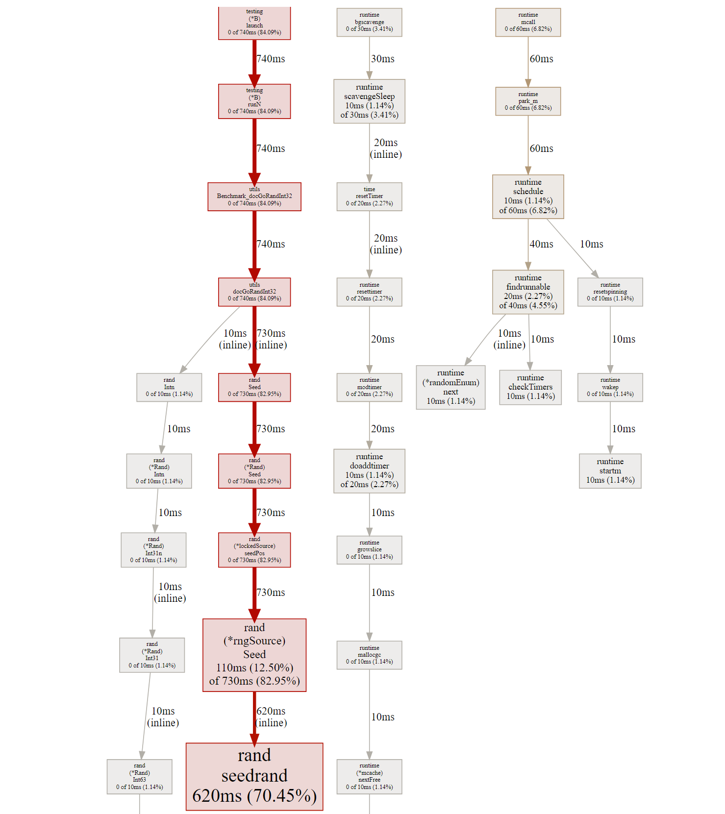
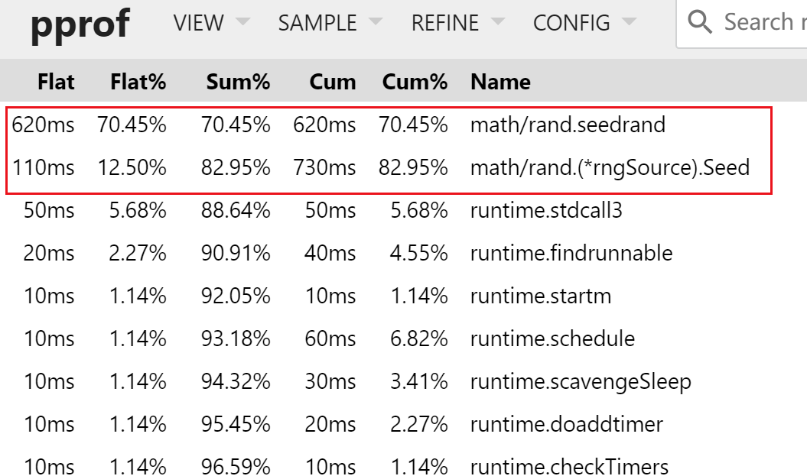
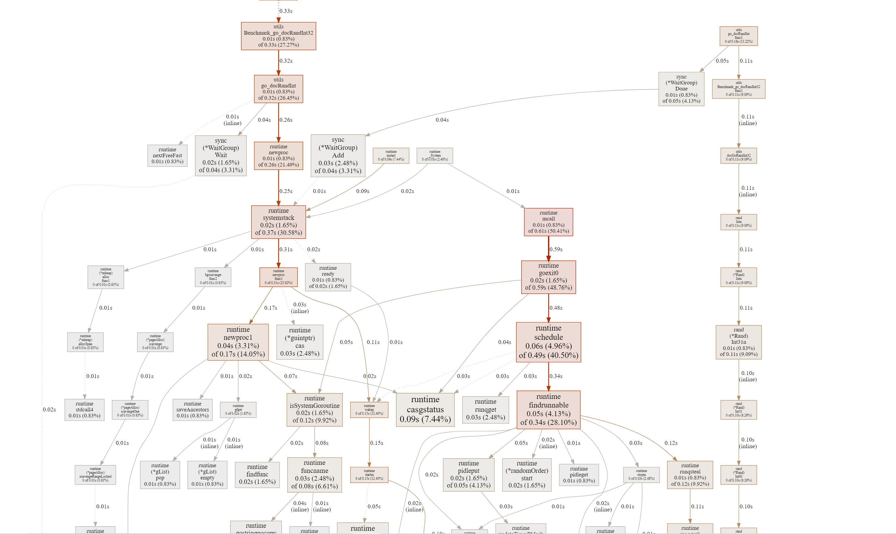
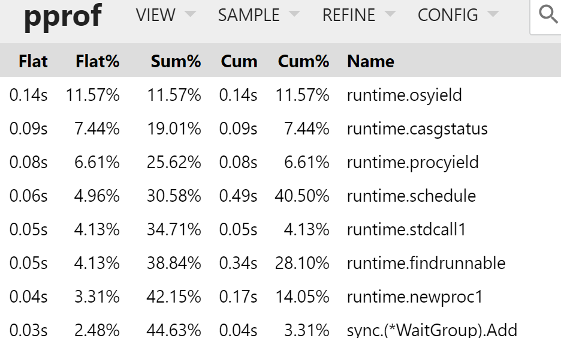
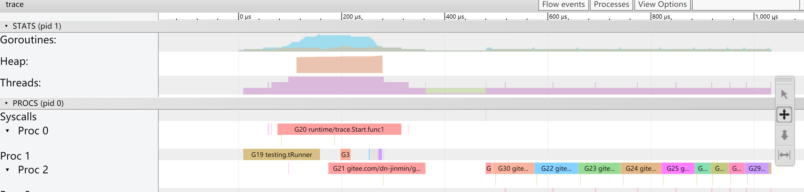
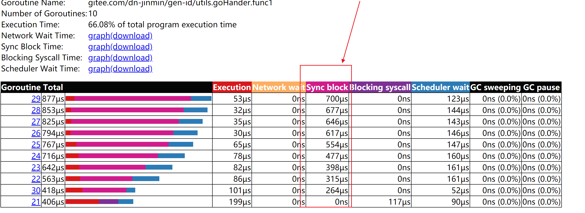
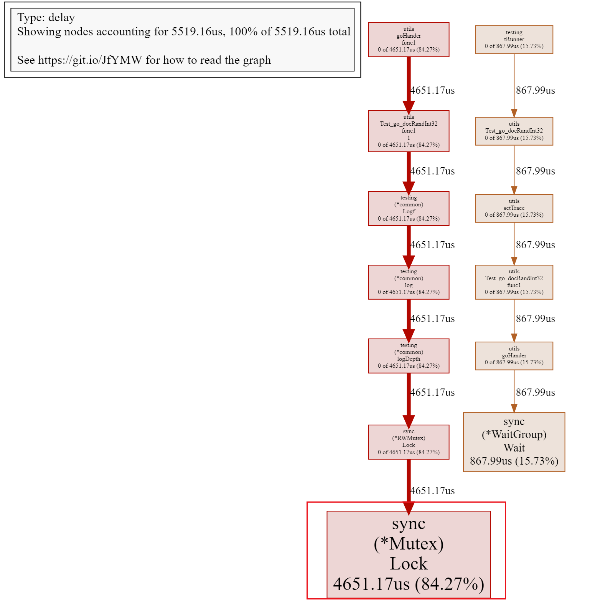
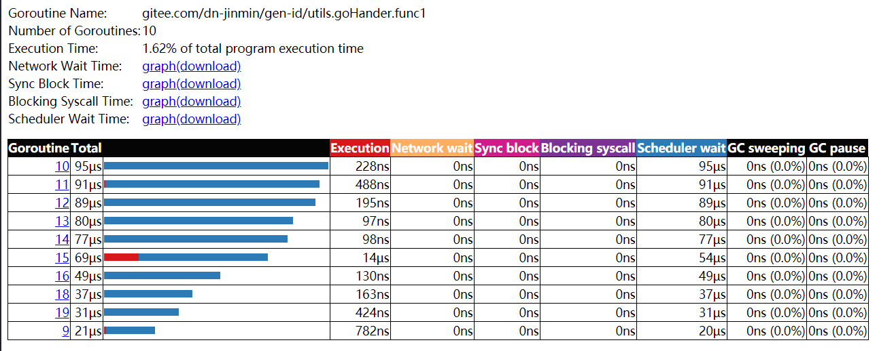

# utils - 优化记录

## 01. 随机int优化

### 01.01 基础功能实现优化

在go中对于随机int数值的方法可以利用标准库在的"math/rand"进行实现；

```go
package utils

import (
	"time"
	"math/rand"
)

func docGoRandInt32(maxN int) int {
	rand.Seed(time.Now().UnixNano())
	return rand.Intn(maxN)
}
```

测试用例

```go
package utils

import "testing"

func Test_docGoRandInt32(t *testing.T) {
	for i := 0; i < 10; i++ {
		t.Logf("docGoRandInt32() = %v", docGoRandInt32(26))
	}
}
```

基准测试用例

```go
func Benchmark_docGoRandInt32(b *testing.B) {
	for i := 0; i < b.N; i++ {
		docGoRandInt32(26)
	}
}
```

基于bench进行测试，如下为测试性能结果

```
D:\project\go\src\gitee.com\dn-jinmin\gen-id\utils>go test -bench=docGoRandInt32 -benchmem
goos: windows
goarch: amd64
pkg: project-admin/common/genid/utils
cpu: Intel(R) Core(TM) i7-8565U CPU @ 1.80GHz
Benchmark_docGoRandInt32-8        122416              8281 ns/op               0 B/op          0 allocs/op
PASS
ok      project-admin/common/genid/utils        1.523s
```

根据测试结果显示对docGoRandInt32函数进行基准测试，每次调用docGoRandInt32函数消耗8281ns，基于122416次调用的平均值，每次操作的上没有内存分配；

不过这个性能上的问题在应用中相对较难接受，我们可以利用pprof分析原因,执行如下命令

```
go test -bench=docGoRandInt32 -benchmem -cpuprofile=docGoRandInt32.prof
go tool pprof -http=:8000 docGoRandInt32.porf
```



可以发现性能瓶颈最终瓶颈在“rand/Seed”方法处



主要因为重复调用"math/rand.Seed"函数导致；基于该现象调整如下

```go
import (
	"time"
	"math/rand"
)

func init()  {
	rand.Seed(time.Now().UnixNano())
}

func docGoRandInt32(maxN int) int {
	return rand.Intn(maxN)
}
```

测试结果

```
D:\project\go\src\gitee.com\dn-jinmin\gen-id\utils>go test -v -run=doc -bench=doc -benchmem
=== RUN   Test_docGoRandInt32
    doc_test.go:7: docGoRandInt32() = 5
    doc_test.go:7: docGoRandInt32() = 1
    doc_test.go:7: docGoRandInt32() = 1
    doc_test.go:7: docGoRandInt32() = 3
    doc_test.go:7: docGoRandInt32() = 0
    doc_test.go:7: docGoRandInt32() = 14
    doc_test.go:7: docGoRandInt32() = 14
    doc_test.go:7: docGoRandInt32() = 20
    doc_test.go:7: docGoRandInt32() = 18
    doc_test.go:7: docGoRandInt32() = 8
--- PASS: Test_docGoRandInt32 (0.11s)
goos: windows
goarch: amd64
pkg: project-admin/common/genid/utils
cpu: Intel(R) Core(TM) i7-8565U CPU @ 1.80GHz
Benchmark_docGoRandInt32
Benchmark_docGoRandInt32-8      63955695                18.50 ns/op            0 B/op          0 allocs/op
PASS
ok      project-admin/common/genid/utils        2.627s
```

### 01.02 基于并发测试调优

通过如上的方式基本实现了关于对随机数值的生成功能，并进行相对的调优;接下来基于并发下进行测试分析如下为示例代码

```go
func Test_go_docRandInt32(t *testing.T) {
	goHander(10, func()  {
		t.Logf("docGoRandInt32() = %v", docGoRandInt32(26))
	})
}

func Benchmark_go_docRandInt32(b *testing.B) {
	for i := 0; i < b.N; i++ {
		goHander(10, func()  {
			docGoRandInt32(26)
		})
	}
}

func goHander(workerNum int, handler func() )  {
	var sg sync.WaitGroup
	for i := 0; i < workerNum; i++ {
		sg.Add(1)
		go func() {
			defer sg.Done()
			handler()
		}()
	}
	sg.Wait()
}
```

测试结果：

```
D:\project\go\src\gitee.com\dn-jinmin\gen-id\utils>go test -v -run=go_doc -bench=go_doc -benchmem -cpuprofile=go_docRandInt.prof
=== RUN   Test_go_docRandInt32
    doc_test.go:22: docGoRandInt32() = 12
    doc_test.go:22: docGoRandInt32() = 6
    doc_test.go:22: docGoRandInt32() = 18
    doc_test.go:22: docGoRandInt32() = 0
    doc_test.go:22: docGoRandInt32() = 5
    doc_test.go:22: docGoRandInt32() = 10
    doc_test.go:22: docGoRandInt32() = 3
    doc_test.go:22: docGoRandInt32() = 23
    doc_test.go:22: docGoRandInt32() = 18
    doc_test.go:22: docGoRandInt32() = 6
--- PASS: Test_go_docRandInt32 (0.00s)
goos: windows
goarch: amd64
pkg: project-admin/common/genid/utils
cpu: Intel(R) Core(TM) i7-8565U CPU @ 1.80GHz
Benchmark_go_docRandInt32
Benchmark_go_docRandInt32-8       244858              5333 ns/op              16 B/op          1 allocs/op
PASS
ok      project-admin/common/genid/utils        1.714s

D:\project\go\src\gitee.com\dn-jinmin\gen-id\utils>
```

功能实现上没问题，但是发现性能不佳；平均执行完成需5333ns；

```
go tool pprof -http=:8000 go_docRandInt.prof
```

分析过程





基于pprof分析在整体上并不能明显的发现问题所在；这个时候可以调整基于trace进行分析查看协程的运行状态；修改代码如下

```go
func Test_go_docRandInt32(t *testing.T) {
	setTrace("docGoRandInt32_trace.out", func(){
		goHander(10, func()  {
			docGoRandInt32(26)
		})
	})
}
func setTrace(name string, handler func()) {
	f, _ := os.Create(name)
	defer f.Close()
	// 启动trace 对程序的执行进行分析捕捉
	err := trace.Start(f)
	if err != nil {
		panic(err)
	}
	defer trace.Stop()

	handler()
}
```

执行命令
```
go test -v -run=go_doc
go tool trace docGoRandInt32_trace.out
```

运行结果



在整体代码的运行上发现并没有运用协程的特点，在执行流程中转向为同步执行

再对创建的协程运行状态观察



可以明显的发现存在较为严重的阻塞问题，再进一步的查看阻塞原因



可以明显发现是因为存在锁机制导致,然后基于对math/rand源码阅读在底层实现``go/src/math/rand/rand.go:lockedSource.Int63()``中发现底层是对数据的读取中有运用加锁来保证线程安全

```go
type lockedSource struct {
	lk  sync.Mutex
	src *rngSource
}

func (r *lockedSource) Int63() (n int64) {
	r.lk.Lock()
	n = r.src.Int63()
	r.lk.Unlock()
	return
}
```

对于该问题优化；直接上代码如下是来自一个开源作者的代码，我在开源基础上增加了对uint64的随机

```go
var rngPool sync.Pool

type RNG struct {
	x uint32
	y uint64
}

func (r *RNG) Uint32() uint32 {
	for r.x == 0 {
		r.x = getRandomUint32()
	}

	// See https://en.wikipedia.org/wiki/Xorshift
	x := r.x
	x ^= x << 13
	x ^= x >> 17
	x ^= x << 5
	r.x = x
	return x
}

func (r *RNG) Uint32n(maxN uint32) uint32 {
	x := r.Uint32()
	// See http://lemire.me/blog/2016/06/27/a-fast-alternative-to-the-modulo-reduction/
	return uint32((uint64(x) * uint64(maxN)) >> 32)
}

func (r *RNG) Uint64() uint64 {
	for r.y == 0{
		r.y = getRandomUint64()
	}

	y := r.y
	y ^= y << 13
	y ^= y >> 7
	y ^= y << 5
	r.y = y
	return y
}
func (r *RNG) Uint64n(maxN uint64) uint64 {
	x := r.Uint64()
	return x % (maxN + 1)
}
func getRandomUint32() uint32 {
	x := time.Now().UnixNano()
	return uint32((x >> 32) ^ x)
}
func getRandomUint64() uint64 {
	x := time.Now().UnixNano()
	return uint64(x)
}
```

实现思路；

1. 首先获取一个固定的随机因子通过``time.Now.UnixNano()``方法获取，会返回从1970到现在的时间戳，通过getRandomUint32与getRandomUint64方法获取
2. 构建属于自己的随机数值对象rng；存在两个属性x,y分别记录随机因子uint32与uint64
3. 在Uint32与Uint64中通过对同一个随机因子进行“位运算+二元运算”重置每次调用的随机因子，确保具有随机性
4. 需要注意在Uint32与Uint64在重置随机因子的时候，是通过复制当前参数给新的对象然后再通过运算重置，最后再设置原有数据结构，这样做的目的是避免并发状态下的数据出现不确定性的问题


测试用例

```go
func TestRNG_Int32(t *testing.T) {
	var rg RNG
	setTrace("docRngInt_trace.out", func(){
		goHander(10, func()  {
			rg.Uint32n(26)
		})
	})
}
func BenchmarkRNG_Int32(b *testing.B) {
	var rg RNG
	for i := 0; i < b.N; i++ {
		goHander(10, func()  {
			rg.Uint32n(26)
		})
	}
}
```

执行如下命令

```
D:\project\go\src\gitee.com\dn-jinmin\gen-id\utils>go test -v -run=RNG_Int32 -bench=RNG_Int32 -benchmem -cpuprofile=rng_int.prof
=== RUN   TestRNG_Int32
--- PASS: TestRNG_Int32 (0.00s)
goos: windows
goarch: amd64
pkg: project-admin/common/genid/utils
cpu: Intel(R) Core(TM) i7-8565U CPU @ 1.80GHz
BenchmarkRNG_Int32
BenchmarkRNG_Int32-8      327736              3345 ns/op              32 B/op          2 allocs/op
PASS
ok      project-admin/common/genid/utils        1.488s
```

可以发现确实在性能上等到了一定的提升，通过对trace分析在程序上就没有阻塞问题



### 01.03 进一步优化

如上的优化主要是针对于单次随机结果的性能优化，在实际的应用中会出现的情况就是，可能具有不确定性连续随机的情况，比如我需要随机一个长度为10的数字要求每个数字都是随机组合的，或者需要随机一个长度为20的英文字母要求每个英文字母都是随机产生不能固定；

实现如下用例：

```go
func TestRNG_Int32(t *testing.T) {
	var rg RNG
	setTrace("docRngInt_trace.out", func(){
		goHander(10, func()  {
			for i := 0; i < 10; i++ {
				rg.Uint32n(26)
			}
		})
	})
}
func BenchmarkRNG_Int32(b *testing.B) {
	var rg RNG
	for i := 0; i < b.N; i++ {
		goHander(10, func()  {
			for i := 0; i < 10; i++ {
				rg.Uint32n(26)
			}
		})
	}
}
```

如上代码，在整个测试用例中对``rg.Uint32n(26)``增加了一个for循环，循环次数10次；其含义在与可以代表当前的这个请求相当于每一次都要连续随机10个随机数；而随机数的范围在0~26之间（代表随机26个英文字母）

测试结果：

```
D:\project\go\src\gitee.com\dn-jinmin\gen-id\utils>go test -v -run=RNG_Int32 -bench=RNG_Int32 -benchmem
=== RUN   TestRNG_Int32
--- PASS: TestRNG_Int32 (0.00s)
goos: windows
goarch: amd64
pkg: project-admin/common/genid/utils
cpu: Intel(R) Core(TM) i7-8565U CPU @ 1.80GHz
BenchmarkRNG_Int32
BenchmarkRNG_Int32-8      204184              6456 ns/op              32 B/op          2 allocs/op
```

针对优化，在rng基础上增加额外的代码封装

```go
func RandIntHandler(maxN, i int, hander func(num, i int))  {
	var y uint32 = rng.Uint32()

	for  {
		if i == 0{
			return
		}
		i--
		// 运算方法
		hander(int((uint64(y) * uint64(maxN)) >> 32), i)

		y ^= y << 13
		y ^= y >> 17
		y ^= y << 5
	}
}

```

在代码中通过rng.Uint32()获取一个随机因子存在y中，然后通过y先进行计算随机的数值并传入到hander方法中，再使用完之后通过同样的“位运算+二元运算”对随机因子进行“重置”，同时再进行len--代表需要随机的次数减一

测试用例：

```go
func TestRNG_Int32Hander(t *testing.T) {
	setTrace("docRngInt_trace.out", func(){
		goHander(10, func()  {
			RandIntHandler(26,10, func(a,i int) {})
		})
	})
}
func BenchmarkRNG_Int32Hander(b *testing.B) {
	for i := 0; i < b.N; i++ {
		goHander(10, func()  {
			RandIntHandler(26,10, func(a,i int) {})
		})
	}
}
```

测试结果与RNG_Int32对比

```
D:\project\go\src\gitee.com\dn-jinmin\gen-id\utils>go test -bench=RNG_Int32 -benchmem
goos: windows
goarch: amd64
pkg: project-admin/common/genid/utils
cpu: Intel(R) Core(TM) i7-8565U CPU @ 1.80GHz
BenchmarkRNG_Int32-8              183133              6135 ns/op              32 B/op          2 allocs/op
BenchmarkRNG_Int32Hander-8        203179              5323 ns/op              16 B/op          1 allocs/op
PASS
ok      project-admin/common/genid/utils        2.480s
```

相对具有一定的提升，主要在于在RandIntHander中减少了对连续随机的因子的拷贝次数，在rng.Uint32中因为需要考虑并发的情况，会先拷贝重置，然后再赋值的过程

```go
x := r.x
x ^= x << 13
x ^= x >> 17
x ^= x << 5
r.x = x
```

而在RandIntHander中获取到随机数值并赋值给y之后便一直围绕y进行处理

```go
var y uint32 = rng.Uint32()

for {
	...

	y ^= y << 13
	y ^= y >> 17
	y ^= y << 5
}
```

目前优化到此处，后续再尝试看能否再进一步优化

### 01.04 总结

> 1. math/rand的实现

在go提供的标准包中的math/rand在实现上是需要我们传递一个随机因子，而在调用随机函数的时候在``go/src/math/rand/rand.go:lockedSource.Int63()``中通过利用到锁机制来实现线程安全问题

```go
type lockedSource struct {
	lk  sync.Mutex
	src *rngSource
}

func (r *lockedSource) Int63() (n int64) {
	r.lk.Lock()
	n = r.src.Int63()
	r.lk.Unlock()
	return
}
```

在实际的引用中会存在协程阻塞的问题；而对其基本的优化就是可以将设置随机种子``	rand.Seed(time.Now().UnixNano())``的过程放在init中初始化；

> 2. 自己实现

实现的思路上就是获取一个随机数值然后一直围绕这个随机数值进行随机运用算，先获取所需要的实际随机值，然后再对随机数值通过固定的方案运算将其随机数值改为其他值以此达到随机的目的；

在本次案例中先是获取``time.Now().UnixNano()``当前时间作为随机数值，也可以统称为随机因子；

再得到因子之后通过``(uint64(y) * uint64(maxN)) >> 32`` 位运算的策略，也可以取模的方式获取随机值

通过如下代码重置随机因子

```go
x := r.x
x ^= x << 13
x ^= x >> 17
x ^= x << 5
r.x = x
```

在细节上x := r.x这一步的赋值是因为避免并发下直接对r.x操作可能会存在数值不确定性的问题；再进一步细节一点的优化可以围绕这个思路再封装一个RandIntHander方法减少连续随机中的赋值参数的拷贝次数


.
